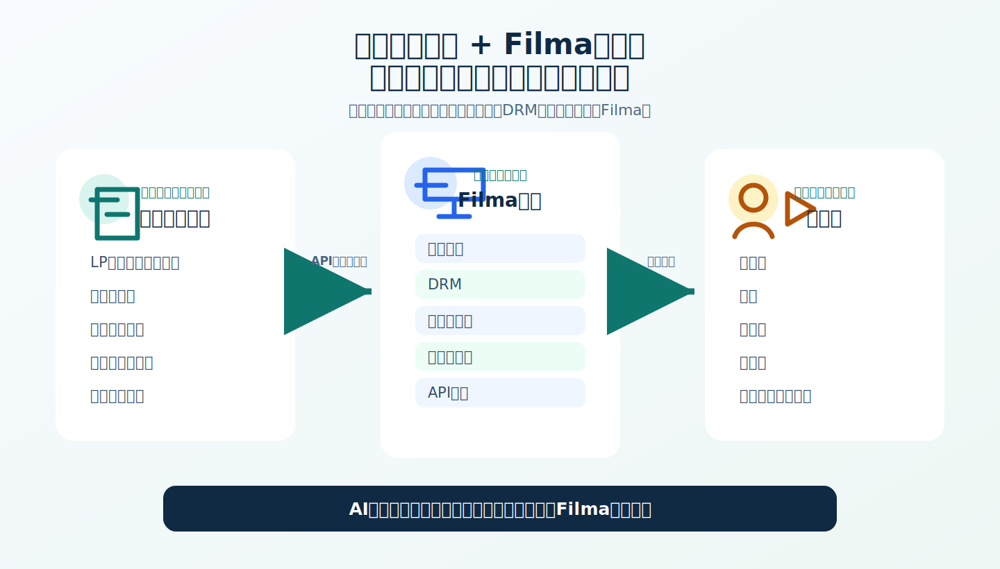
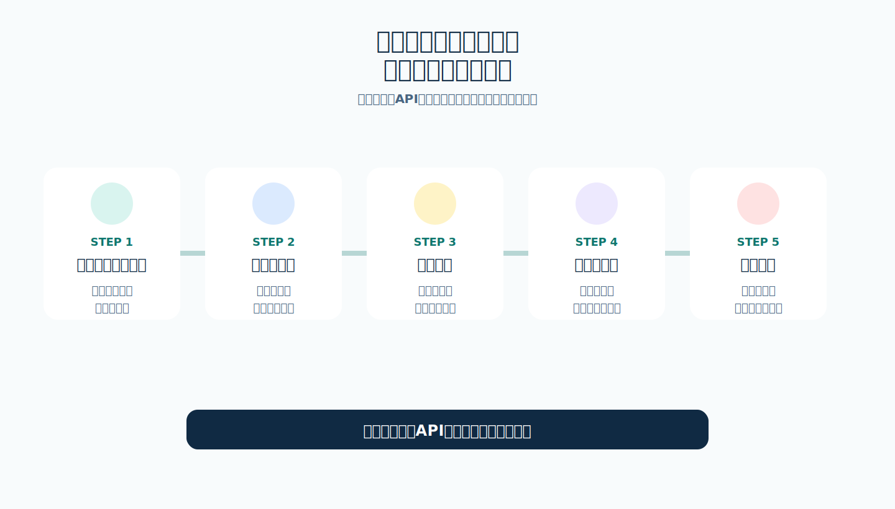
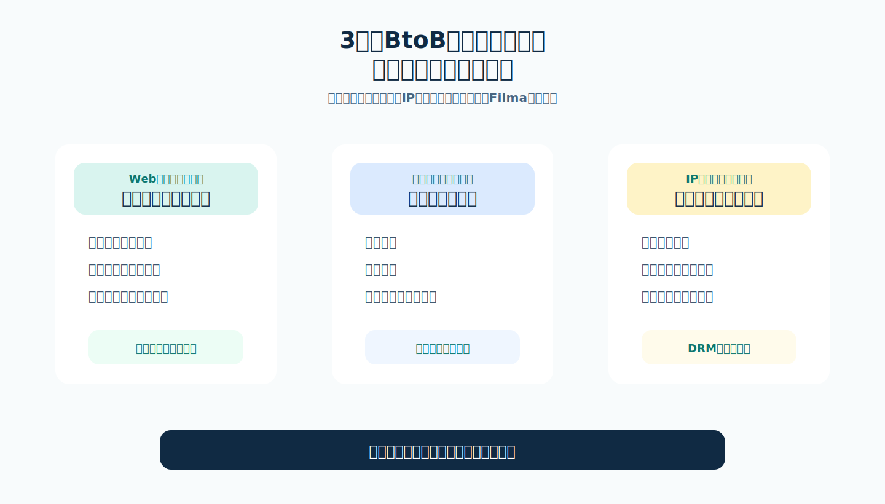
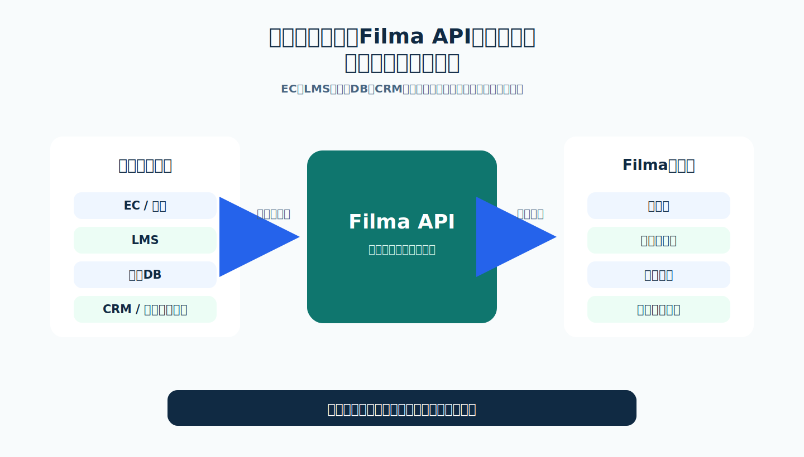

# AIや自社開発で、会員限定の動画配信ページをリーズナブルに構築

Filmaは、完成済みの動画配信SaaSをそのまま使いたい企業ではなく、AI、自社開発、Web制作会社・システム開発会社の開発力を活用しながら、独自の動画配信ページを構築したい企業のための動画配信基盤です。

動画管理、DRM、視聴プラン、会員ごとの視聴権、API連携を備え、会員限定動画、講座動画、セミナーアーカイブ、レッスン動画、ファン向け限定映像、IPコンテンツ配信などの構築を支援します。

## こんな方に向いています

- Web制作・システム開発案件で、動画配信機能をクライアントに提案したい
- eラーニング、セミナー、レッスン映像を会員限定で配信したい
- アニメなどのアダルト以外のグローバルIPを、自社ブランドで配信したい
- AIコーディング、ローコード、自社開発を活用して低コストに立ち上げたい
- YouTubeや一般的な動画ホスティングではなく、購入者・受講者・会員ごとに動画を出し分けたい
- 既存の会員DB、EC、LMS、CRM、業務システムと動画視聴権を連携したい

## 動画配信ページは、見た目よりも開発範囲が広がりやすい

会員限定の動画ページや講座動画販売サイトは、単に動画を埋め込むだけでは成立しません。動画ファイル管理、公開・非公開、会員登録、ログイン、視聴権、DRM、再生制御、管理画面、外部システム連携まで考える必要があります。

完成済みSaaSはすぐ使える一方で、画面や導線、既存システムとの連携に制約が出ることがあります。一方、すべてをゼロから作ると、開発工数や運用負荷が大きくなります。

## Filmaを動画配信の基盤にして、ページや導線は自由に設計

Filmaは、動画ファイルの管理、MPEG-DASHによる配信、DRM、視聴プラン、会員管理、視聴権付与、API連携を提供します。

LP、申込フォーム、決済導線、会員ページ、ブランド体験、既存DBとの連携は、自社や制作会社が自由に設計できます。AIコーディングやローコード開発と組み合わせることで、動画配信ページの立ち上げを現実的なコストに近づけます。

## Web制作・システム開発会社向け

クライアントから会員限定動画、講座動画販売、セミナーアーカイブ配信、購入者限定動画ページを相談されたとき、動画配信基盤まで自社で作ると開発範囲が広がります。

Filmaを使うことで、動画管理や視聴権管理の土台を利用しながら、フロントエンド、デザイン、申込導線、決済連携、業務システム連携など、クライアントごとの差別化部分に集中できます。

提案しやすい案件:

- 会員制動画サイト制作
- 動画教材販売サイト制作
- セミナーアーカイブ配信サイト制作
- ファン向け限定動画配信ページ制作
- 既存Webサービスへの動画配信機能追加
- AIコーディングを活用した低コストな動画配信ページ構築

## eラーニング・セミナー・レッスン映像配信向け

講座、研修、セミナー、レッスン動画では、受講者や購入者ごとに閲覧できる動画を分ける必要があります。

Filmaでは、複数の動画を視聴プランとしてまとめ、会員ごとに視聴権を付与できます。購入済み講座、法人契約、社内研修対象者、個別レッスン受講者など、利用者の状態に応じて閲覧できる動画を制御する設計に向いています。

活用例:

- 有料講座の購入者だけに動画を見せる
- 法人研修の対象社員だけに研修動画を見せる
- セミナー申込者だけにアーカイブ動画を見せる
- レッスン受講者ごとに閲覧できる動画を分ける
- 既存の申込フォームや決済システムから視聴権を付与する

## グローバルIP・アニメ・ファン向け動画配信向け

アニメ、キャラクター、映画、舞台、音楽、イベント、スポーツ、教育コンテンツなどのIPを持つ企業では、自社ブランドでファン向け動画を配信したいニーズがあります。

YouTubeや汎用動画プラットフォームは集客力がある一方で、会員・商品・契約・地域・キャンペーン単位で細かく視聴権を管理したい場合や、自社ブランドの会員体験を作りたい場合には制約が出ることがあります。

Filmaは、動画コンテンツを管理し、視聴プランと会員ごとの視聴権を組み合わせることで、自社配信や会員限定配信の土台として利用できます。

活用例:

- アニメ作品の会員限定特典映像
- イベント参加者向けのアーカイブ配信
- 海外ファン向けの限定動画ページ
- IPホルダーが運営する公式動画ページ
- 制作会社や開発会社が構築するIP向け配信システム

## 外部システムとAPIでつなげられます

Filmaは、EC、LMS、会員DB、CRM、業務システムなどと組み合わせる構成を検討できます。申込、購入、契約、受講、社内権限などの状態に応じて、外部システムから動画の視聴権を付与する設計に向いています。

## Filmaでできること

- 管理画面から動画ファイルをアップロード
- フォルダによる動画ファイル管理
- 公開・非公開の状態管理
- MPEG-DASHによるアダプティブストリーミング配信
- Widevine、PlayReady、FairPlayに対応したマルチDRM
- 複数動画をまとめた視聴プラン管理
- 会員管理
- メール認証付きの会員登録
- 認証コードによるログイン
- 会員ごとの視聴権付与
- 視聴プラン単位の閲覧制御
- APIキー、APIユーザー、アクセスドメイン設定
- 外部システムからの視聴権付与連携

## 開発者向け情報

技術検討では、APIリファレンスやサンプルコードを確認できます。

- [Filma技術概要](technical-overview.md)
- [APIリファレンス](api_specification.md)
- [認証無し動画サンプル](template-no-auth/)
- [JWT認証付き動画サンプル](template-jwt/)

## Filmaが合わないケース

Filmaは、完成された動画配信SaaSを契約して、そのまま画面も運用もすぐ使いたい場合には最適ではない可能性があります。

また、動画配信、会員管理、決済、マーケティング、LMS、CRM、分析まで一体化した大規模な統合サービスを求める場合は、専用SaaSや大規模プラットフォームの方が合う場合があります。

Filmaが向いているのは、動画配信の基盤を活用しながら、自社やクライアントに合わせたページ、導線、連携、ブランド体験を作りたいケースです。

## まずは構成を相談してください

会員限定動画、講座配信、セミナーアーカイブ、IPコンテンツ配信など、作りたい動画配信ページの内容に応じて構成をご提案します。

相談時には、次の内容が分かるとスムーズです。

- どの動画を、誰に、どの条件で見せたいか
- 会員登録やログインをFilma側で行うか、既存システムと連携するか
- 視聴権を購入、契約、受講、社内権限、キャンペーンのどれに連動させるか
- 動画コンテンツにDRMが必要か
- 管理画面で手動運用する範囲と、APIで自動化する範囲
- フロントエンドを自社開発、制作会社、AIコーディングのどれで構築するか

現在、ローンチ直後のため、申し込みは原則として紹介制としています。動画配信ページの構築をご検討の場合は、まずは構成をご相談ください。

## 関連情報

- [ご利用規約](terms_of_service_template.md)
- [サービスレベルアグリーメント](service_level_agreement.md)
