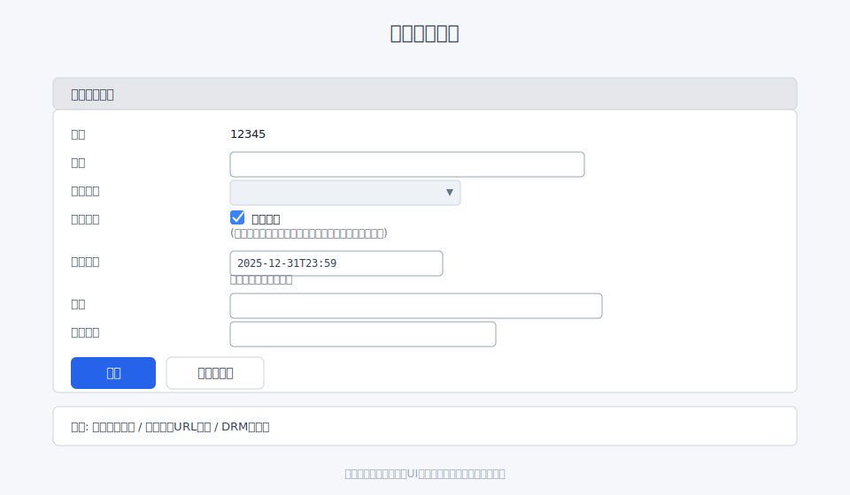
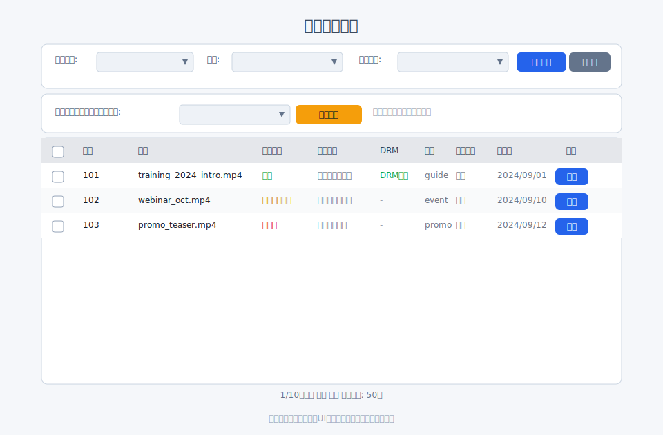

# DRM化（コピーガード）

## DRMとは

DRM（Digital Rights Management）は、動画コンテンツの不正コピーや無断配布を抑止するための保護技術です。
再生時にライセンス認証を行い、許可された環境でのみ復号して再生します。

Filmaにおける「許可された環境」とは、Filmaの再生ページ・再生API経由で、
有効な認証情報（会員セッションやJWT付きURLなど）を使って再生している状態を指します。

Filmaでは、DRMは「配信時の保護」を目的として利用します。
そのため、**ストリーミング再生のみ**が対象で、ダウンロードファイルは対象外です。

> 重要: DRM化したファイルは元に戻せません。

## 画面URL

- ファイル一覧: `/filmaadmin/file`
- ファイル詳細: `/filmaadmin/file/detail/:file_id`
- アップロード: `/filmaadmin/file/upload/:folder_id`

## アップロード時にDRM化する

1. アップロード画面でファイルを選択
2. 「**DRM化する**」にチェック
3. 「アップロード」を押下

アップロード完了後、DRM付きのエンコードタスクが登録されます。

## 既存ファイルをDRM化する

1. ファイル詳細 `/filmaadmin/file/detail/:file_id` を開く
2. 「操作」カードの **DRM化する** をクリック
3. 確認画面で内容を確認し、実行

DRM化対象:
- 親メディアファイル
- エンコード済みの派生メディア

## 表示と確認ポイント

- ファイル一覧/詳細の **DRM** 欄に「DRMあり」バッジが表示されます
- 「メディアファイル情報」の **ダウンロード** には注意書きが表示されます
  （DRMはダウンロードに適用されません）
- 「ファイル処理状況」に **DRM** の進行状況が表示されます

## DRM化できないケース

以下の場合はボタンが表示されない、または実行できません:

- すでにDRM化済み
- エンコード処理中
- ファイル処理が失敗している

---

### 関連

- 動画のアップロード: [動画のアップロード](upload.md)
- 動画の公開: [動画の公開](publish.md)
