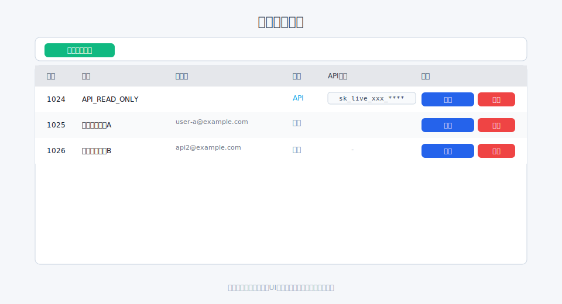
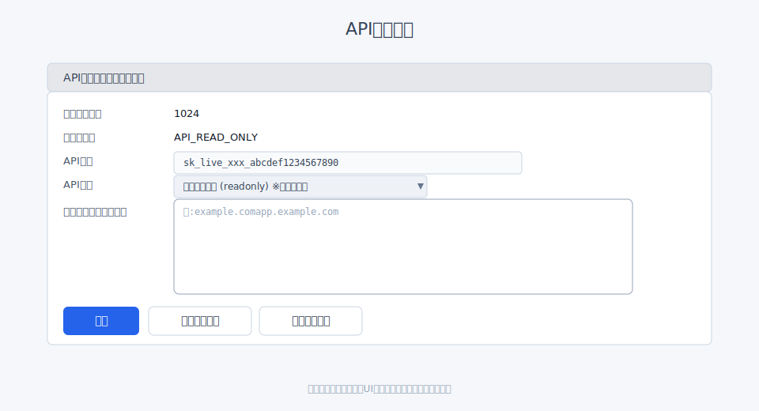

# 埋め込みHTMLを使ったサイト埋め込み

[← クイックスタートへ戻る](index.md#_3)

> 重要: 埋め込みHTMLでも「アクセス許可ドメイン」の設定が必要です。初期アカウント発行時に自動作成される「デフォルトのAPIユーザー（APIキー保有）」の API 設定で、自サイトのドメイン名を登録してください（サブドメイン可）。未設定のままでは自社サイトからの再生が拒否されます。

## 事前準備（初回のみ）

1. ユーザー一覧 `/filmaadmin/user` を開く
   
2. 初期アカウント発行時に自動作成された「デフォルトのAPIユーザー」(API_READ_ONLY)を開く
3. 「APIキー」をクリックして「API設定編集」(`/filmaadmin/apisettings/edit/:user_id`) を開く
   
4. 「アクセス許可ドメイン」に自サイトのドメイン名を1行につき1件で登録（例: `example.com`, `app.example.com`）→ 保存
   - URLで入力しても保存時にドメイン名（ホスト部）へ自動変換されます
   - `example.com` と入力すると、その配下のサブドメイン（www.example.com / app.example.com など）も許可されます
   - 特定のサブドメインのみ許可したい場合は `app.example.com` のようにサブドメインまで入力してください
   - 間違った形式はエラーになります
5. （閲覧のみなら）API種類は `readonly` のままでOK

## 埋め込みHTMLの取得と貼付け

1. ファイル詳細 `/filmaadmin/file/detail/:file_id` を開く
   ※「派生メディア」は折りたたみ表示のため、見出しをクリックして開きます。
   
2. 「派生メディア」表の 対象解像度行で「埋め込みHTMLをコピー」
3. コピーしたHTMLを自サイトに貼り付け

補足: 解像度を選ばずに簡易的に埋め込みたい場合は、
「メディアファイル情報」の **ストリーミング** にある「埋め込みHTMLをコピー」でも取得できます。

## 注意

- 対象ファイルが「公開」になっていること
- 必要に応じて「公開期限」を設定

## アクセス許可ドメインのOK/NG例（正規化ルール）

- 入力は1行に1つ。URLを入力しても保存時にドメイン名（ホスト部）へ自動変換されます。
- ワイルドカード（`*.example.com` など）は不可。サブドメインは親ドメインの許可でカバーされます。

OK例

- `example.com` → example.com とそのサブドメイン（www.example.com, app.example.com など）も許可
- `https://www.example.com/path` → 正規化して `www.example.com` を登録
- `APP.EXAMPLE.COM` → 大文字は小文字に正規化（`app.example.com`）

NG例（保存時にエラー）

- `http://` や `https://` のない不正URLで、ドメイン名の抽出ができないもの
- ドメイン形式でない文字列（空白や記号を含むなど）
- ワイルドカード表記（`*.example.com`）

ヒント

- 迷ったら「ドメイン名（ホスト名）」だけを入力してください（例: `video.example.co.jp`）。
- サブドメインを個別に絞りたい場合は、親ドメインではなくサブドメインを行ごとに登録してください。

## よくある失敗と対処

症状: 埋め込みページで再生が始まらない / 403 に見える

- 原因1: アクセス許可ドメイン未設定またはドメイン不一致
    - 対処: 「API設定編集」で埋め込みページのドメイン名を登録（例: `news.example.com`）。
    - 注意: `example.com` を登録すれば `www.example.com` や `app.example.com` も許可されます。

- 原因2: ファイルが未公開/公開期限切れ
    - 対処: 「ファイル編集」で「公開する」をON、必要に応じて公開期限を延長。

- 原因3: Mixed Content（HTTPサイトにHTTPSリソース、または逆）
    - 対処: 可能な限り、埋め込み先も配信元もHTTPSに統一。

- 原因4: CORS/ブラウザ制限（iOSの自動再生など）
    - 対処: ブラウザコンソールでエラーを確認。自動再生はミュート必須などの要件を検討。

- 原因5: キャッシュ/古いHTML
    - 対処: ブラウザのキャッシュクリア、ページのハードリロード、CDNがあればパージ。

デバッグのコツ

- ブラウザの開発者ツール（Console/Network）でエラーを確認。
- 直接再生用URL（または期限付きURL）で動作するかを切り分け。
- 403/401 等のレスポンスが出る場合は、公開状態とアクセス許可ドメインを再確認。

---

### 次にやること / 関連

- 期限付きURLの発行・管理: [期限付きURLの発行](signedurl.md)
- APIでの埋め込みに切り替える: [APIを使った埋め込み](embed_api.md)
- WordPress で使いたい: [WordPressへの埋め込み](embed_wordpress.md)
