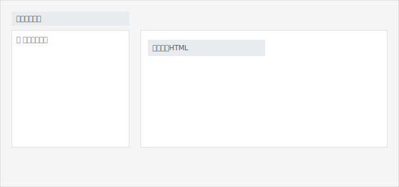
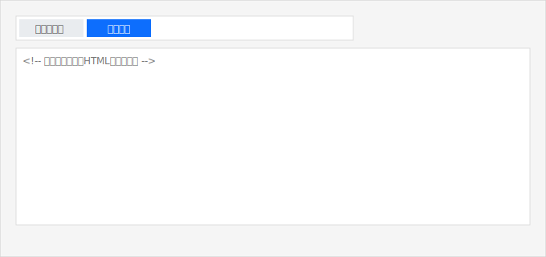

# WordPress への埋め込み

Filma の埋め込みHTMLを貼り付けるだけで、WordPress 投稿/固定ページに動画プレイヤーを表示できます。

## 前提

- 対象ファイルが「公開」になっていること（必要なら公開期限を設定）
- アクセス許可ドメインに、公開先サイトのドメイン名（例: `example.com`）が登録されていること（サブドメイン可）
  - 設定場所: 管理画面 → ユーザー → デフォルトAPIユーザー → API設定編集

## 手順（Gutenberg ブロックエディタ）

1. Filma 管理画面で対象ファイルの「ファイル詳細」を開く
   ※「派生メディア」は折りたたみ表示のため、見出しをクリックして開きます。
2. 「派生メディア」表の DASH 行にある「埋め込みHTMLをコピー」を押す
3. WordPress の投稿/固定ページ編集で、ブロックを追加 →「カスタム HTML」を選択
    
4. コピーした埋め込みHTMLを貼り付ける
5. 右上「プレビュー」で再生できることを確認 → 公開（更新）

## 手順（Classic エディタ）

1. Filma 管理画面で対象ファイルの「ファイル詳細」を開く
   ※「派生メディア」は折りたたみ表示のため、見出しをクリックして開きます。
2. 「派生メディア」表の DASH 行にある「埋め込みHTMLをコピー」を押す
3. WordPress の投稿/固定ページ編集で、エディタを「テキスト」（HTML）タブに切り替える
    
4. コピーした埋め込みHTMLを本文に貼り付ける
5. 「ビジュアル」タブに戻してレイアウトを確認（崩れる場合はそのままテキストでOK）
6. プレビューで再生できることを確認 → 公開（更新）

## うまくいかない場合のチェック

- 再生できない: アクセス許可ドメインが未設定/不一致の可能性 → 正しいドメイン名を登録（例: `news.example.com`）
- 画面が真っ白: ファイルが未公開/公開期限切れ → 公開状態を確認
- 常時HTTPSのサイト: 埋め込み先・配信元ともにHTTPSで統一（Mixed Content対策）

補足: テーマやプラグインがスクリプトを制限している場合は、埋め込みがブロックされることがあります。その場合はサイト管理者にご相談ください。

> スクリーンショットは実画面に差し替え可能です。`filma_doc/admin_manual/docs/img/` 配下のプレースホルダを置き換えてください。
