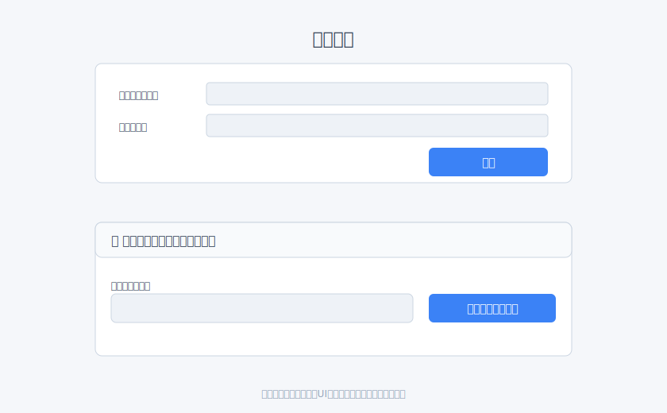
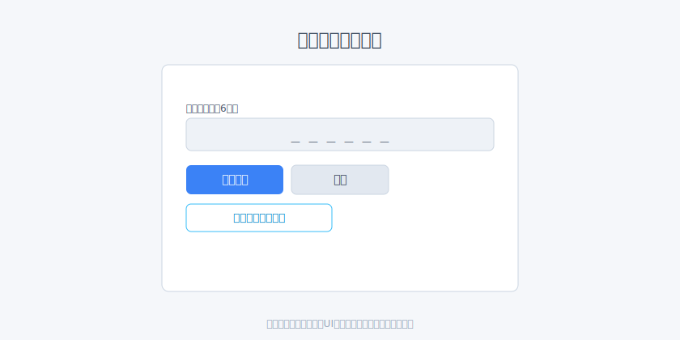

# ログイン

## 画面URL

- ログイン: `/filmaadmin`
- ログアウト: 右上メニューから実行（同URLにリダイレクト）

## 手順

- メール + パスワードでログイン
    - `/filmaadmin` → 「メールアドレス」「パスワード」入力 → 送信

    

- 認証コードでログイン（推奨）
    - 「メール認証コードでログイン」→ メールアドレス入力 → 認証コード受信 → 「認証コードの確認」に6桁入力 → ログイン

    

## ログアウト

- 右上のメニューから「ログアウト」

## トラブルシュート

- メール/パスワード誤り: 再入力。認証コードログインが使える場合はそちらを利用
- メールが届かない: 迷惑メールやフィルタを確認。ドメイン許可設定を確認

---

### 次にやること / 関連

- アップロードへ進む: [動画のアップロード](upload.md)
- 画面遷移を確認: [画面URLと遷移](routes_flow.md)
