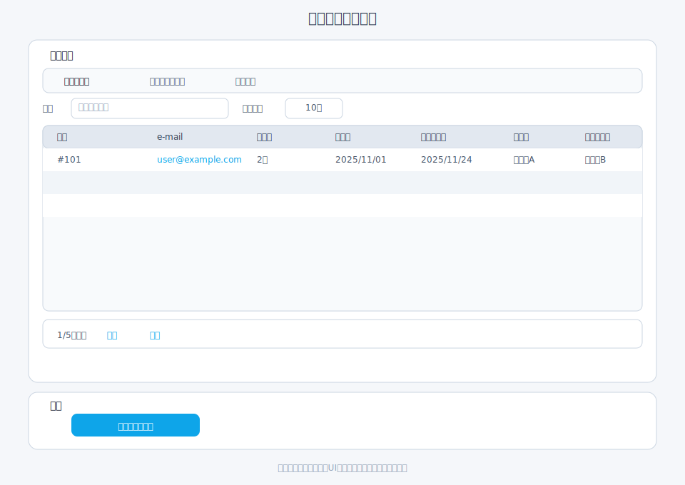
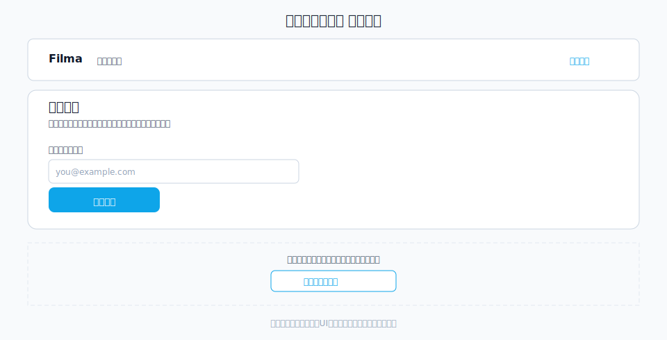
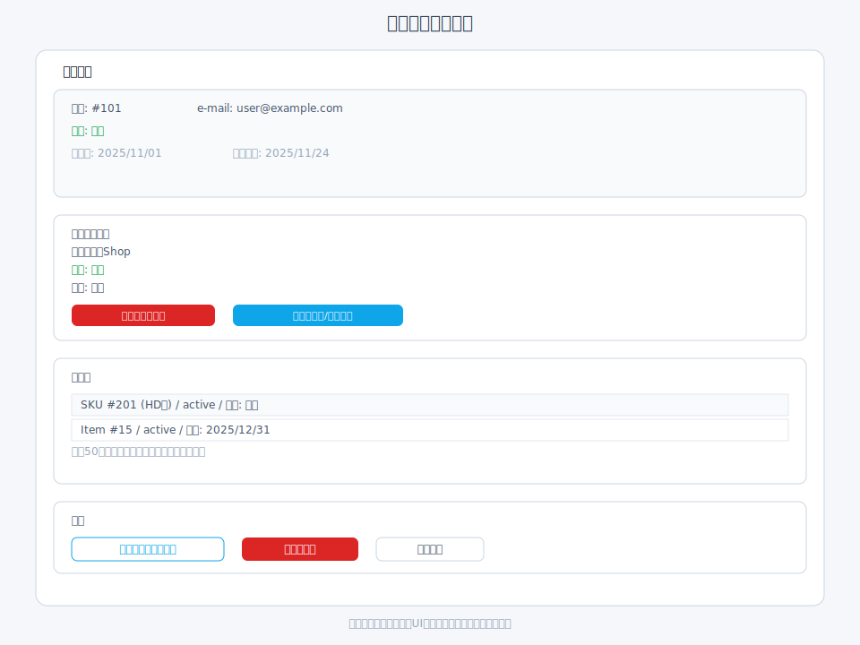
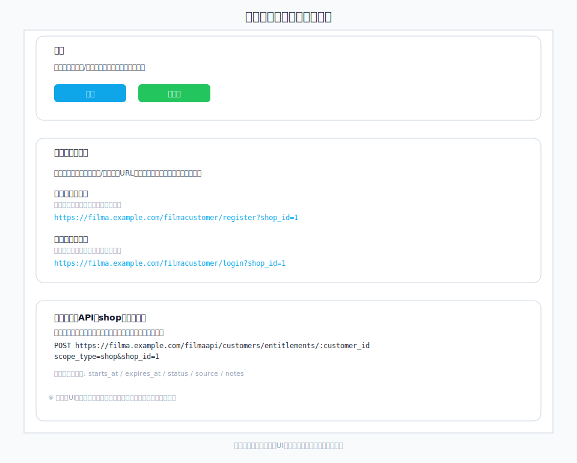
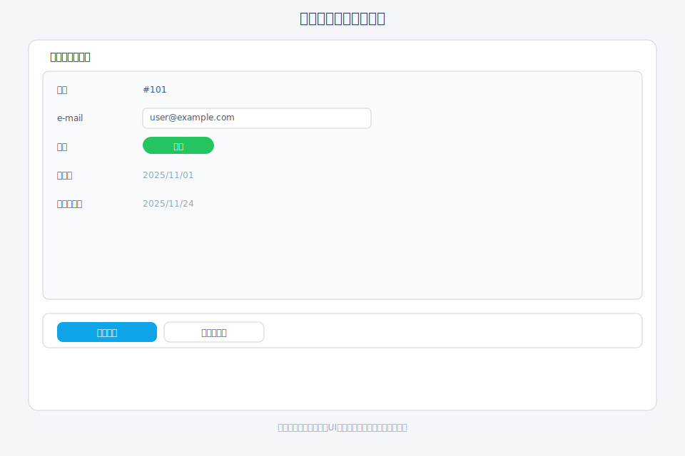
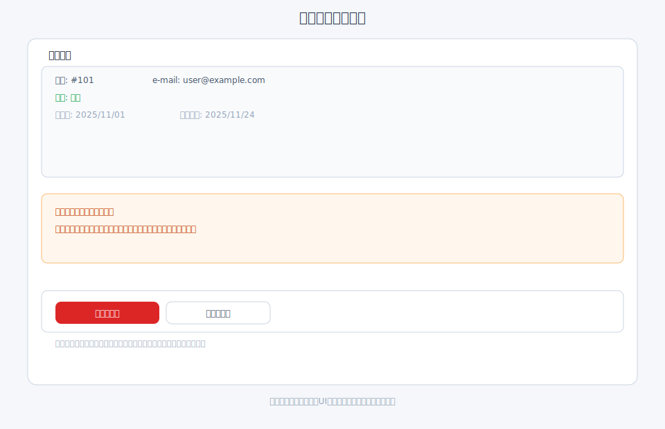
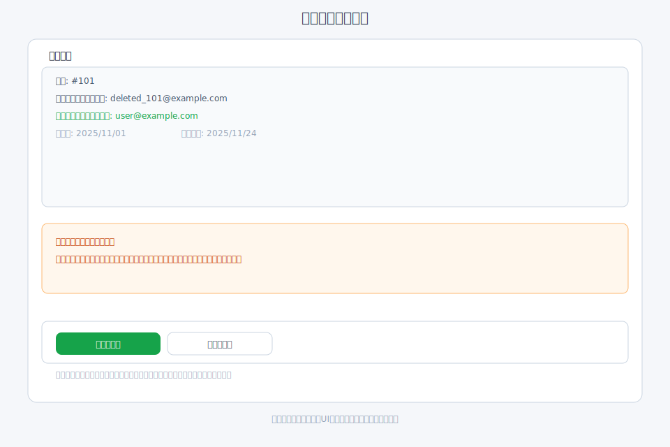
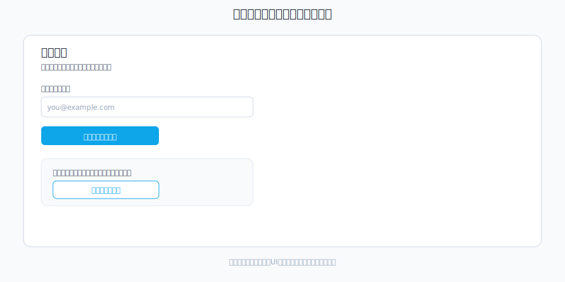
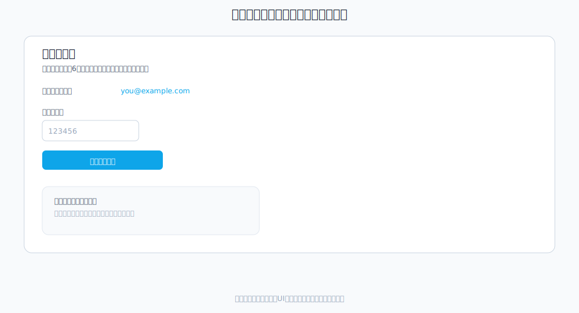

# 会員管理

会員の登録・閲覧・更新・退会/復活の手順をまとめます。ログイン手段はメール認証コードのみです。

## 会員の確認

- 一覧/検索: `/filmaadmin/customer` で会員を検索・表示できます。
- 詳細: 会員詳細から所属ショップ（単一ショップ前提）、視聴権、最終ログインなどを確認。
  

## 登録方法

- 自登録フロー: 会員向けの登録ページ（例: `/filmacustomer/register?shop_id=...`）からメール認証で登録。
  
- 管理者追加（必要時）: 管理画面から新規会員を追加し、有効化/所属を設定。
  
- 登録/ログインURL: ショップ設定画面（`/filmaadmin/shop`）の「会員向けリンク」に案内用URLが表示されます。案内メールやヘルプに転記する際はここを参照してください。
  

## 会員情報の更新

- 管理画面の会員詳細から「会員情報を編集」を開き、e-mailのみを更新して保存します。メール重複チェックや形式チェックに通らない場合はエラーメッセージを確認してください（氏名は設定しません）。
  

## 退会/復活

- 退会: 会員向け画面で本人が退会可能。管理画面からも退会処理ができます。
- 復活: 誤退会などの場合は管理画面で復活させ、メール重複がないことを確認してください。
  
  

## 認証とログイン確認

- 認証コードが届かない場合: 入力メールアドレス、迷惑メールフォルダ、送信制限（連続リクエスト）を確認。
- ログイン後は再生に必要な権限が自動で付与されます。
  
  
