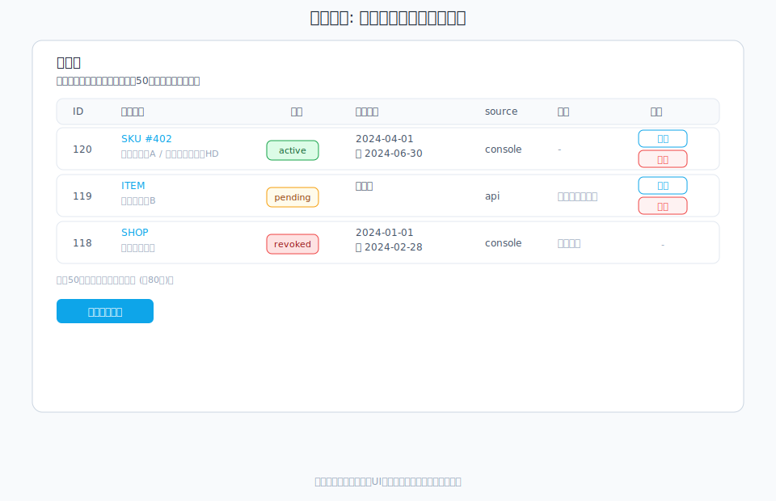
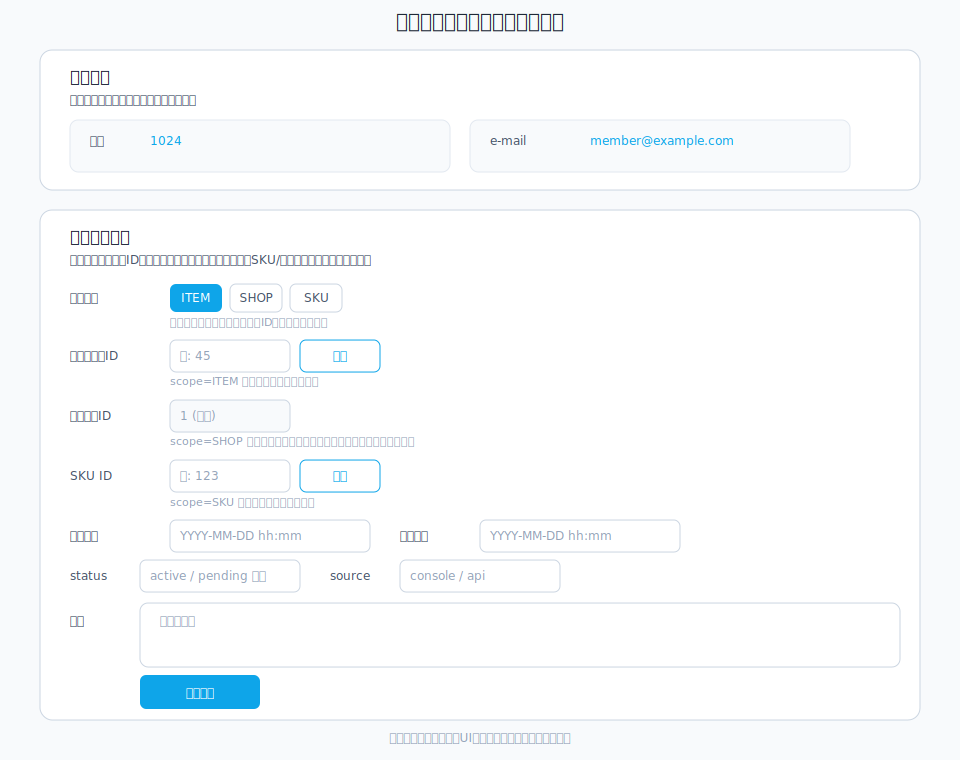

# 視聴権管理

会員が再生できる範囲をSKU/視聴プラン単位で付与・剥奪します。単一ショップ運用を前提とします。視聴権の一覧は会員詳細画面にあり、付与・編集・剥奪は別画面へ遷移して操作します。

## 画面イメージ

- 会員詳細の「視聴権」カード（一覧）
  
- 視聴権の付与画面（別画面）
  

## 付与手順

1. 管理画面の会員一覧（`/filmaadmin/customer`）で対象会員を開く。
2. 視聴権付与フォームでスコープを選択し、期限が必要なら設定。
    - ITEM: 指定した視聴プランの再生を許可（通常はこちらを推奨）
    - SHOP: ショップ内のすべての視聴プランの再生を許可
    - SKU: 視聴プラン内の指定した解像度のストリーミングやダウンロードを許可（特殊な用途向け）
3. 保存して付与完了。会員画面の「閲覧可能な視聴プラン」に反映されます。

## 剥奪/更新

- 期限変更や無効化は同じ画面から編集可能です。
- 権限を剥奪すると再生不可になるため、運用側と利用者への周知を行ってください。

## 表示・再生の挙動

- 会員向け画面の「閲覧可能な視聴プラン」に視聴プラン単位で表示され、アクセスできる動画が並びます。
- SKUスコープで視聴権を付与した場合: 対象SKUに紐づく動画が表示され、配信形式がダウンロードであればダウンロードリンクも表示されます。
- 視聴プラン/ショップスコープで視聴権を付与した場合: 視聴プランに紐づく親Mediafileのストリーミングのみが表示されます（ダウンロードやSKU単位の媒体は表示しません）。
- 視聴権がない場合は再生できません。

## トラブルシュート

- 「視聴権がありません」等のエラー時は以下を確認:
  - 対象会員に正しいSKU/視聴プランの視聴権が付与されているか
  - 期限切れになっていないか
  - 紐づけたMediafileが公開状態か
