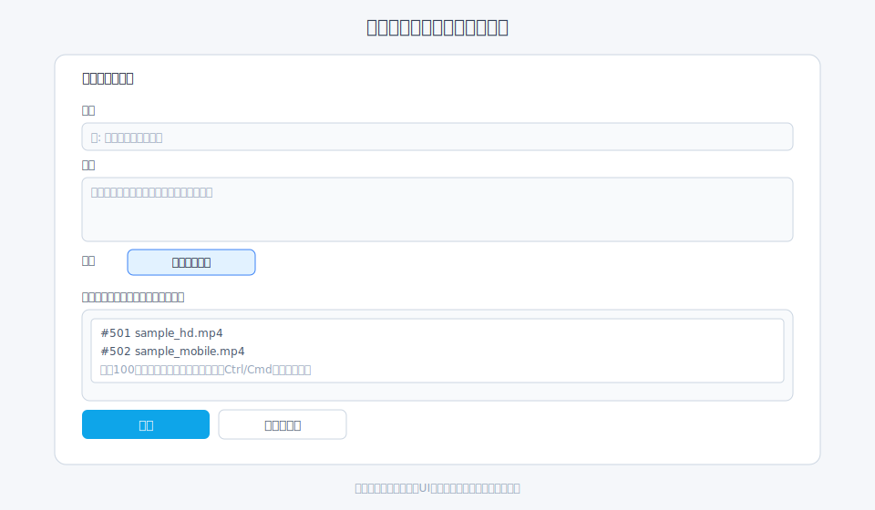
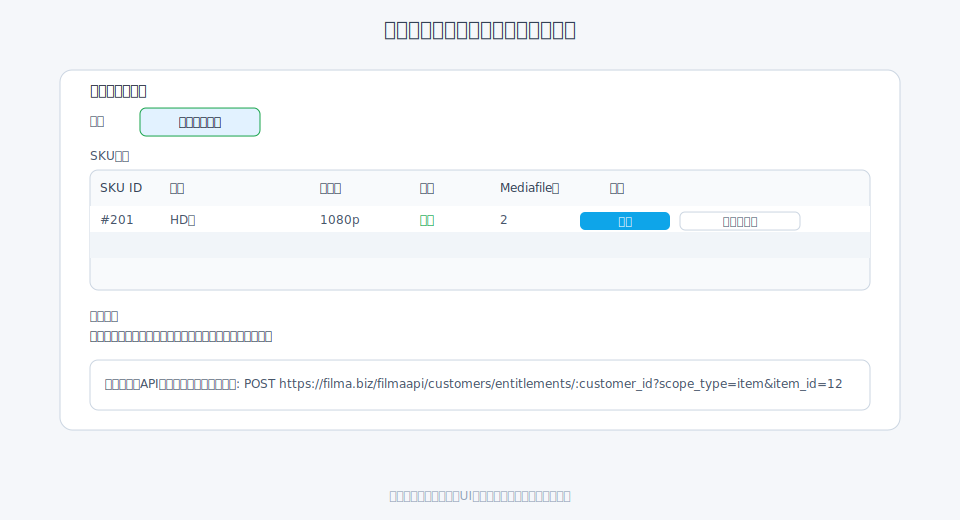
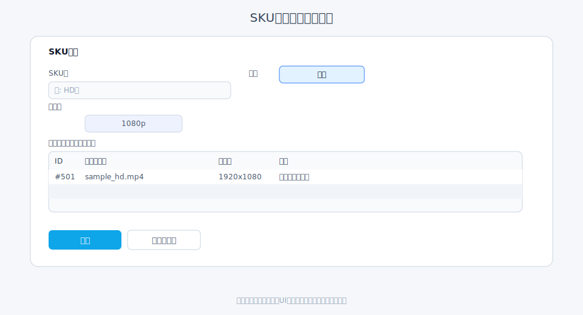

# 視聴プラン・SKU管理（会員向け）

会員が再生できる動画は、視聴プラン(Item)とSKUを通じて管理します。SKUにMediafileを紐づけ、会員にSKU/視聴プラン単位で視聴権を付与します。

## 基本フロー

1. 視聴プランを作成: 視聴プランメニューで新規登録し、タイトル/説明を設定。フォームの「ファイルを紐づける」で最新100件から複数選択できます（Ctrl/Cmdで複数選択）。
   
2. ファイルを視聴プランに追加: 視聴プラン詳細の「ファイルを追加」からMediafileを紐づけると、解像度 × 配信種別（ストリーミング/ダウンロード）ごとにSKUが自動生成されます。
   
3. SKUを編集: 自動生成されたSKUで、状態（有効/無効）や名称を編集します。
   
4. 公開状態を確認: 視聴プランが「公開」か、SKUが「有効」かを確認し、必要に応じて切り替えます（視聴プランを非公開にすると会員画面からも非表示）。

## 設定のポイント

- ファイル追加でSKU自動生成: 視聴プランにファイルを紐づけるとSKUが作成されます。解像度 × 配信種別（ストリーミング/ダウンロード）単位で自動生成されるため、必要なMediafileをまとめて追加してください。
- SKU編集: 状態や名称をSKU編集画面で更新できます。
- 視聴プラン説明: 会員画面の「閲覧可能な視聴プラン」に表示されるため、概要や注意事項を簡潔に記載します。
- 有効状態の整合性: 視聴プランを無効化すると配下のSKUも無効扱いとなり、APIは `item_disabled` や `sku_disabled` を返します。再生させる場合は視聴プラン・SKUを有効にしてください。
- 付与スコープの使い分け: 視聴権は SHOP（全視聴プラン）、ITEM（単一視聴プラン）、SKU（特定解像度/配信種別）の順で広い範囲から選択できます。通常は ITEM/SHOP を優先し、SKU は特定の解像度のストリーミングやダウンロードを許可したい場合など特殊用途で使います。

## 変更/削除時の注意

- SKUに紐づく視聴権がある場合、紐づけ解除や削除は再生不可につながります。事前に影響範囲を確認してください。
- 視聴プランを非公開にすると会員画面から非表示になりますが、既存の視聴権を持つ会員が直接再生リンクを持っている場合は再生可否が挙動に影響するため、合わせて視聴権を見直してください。
