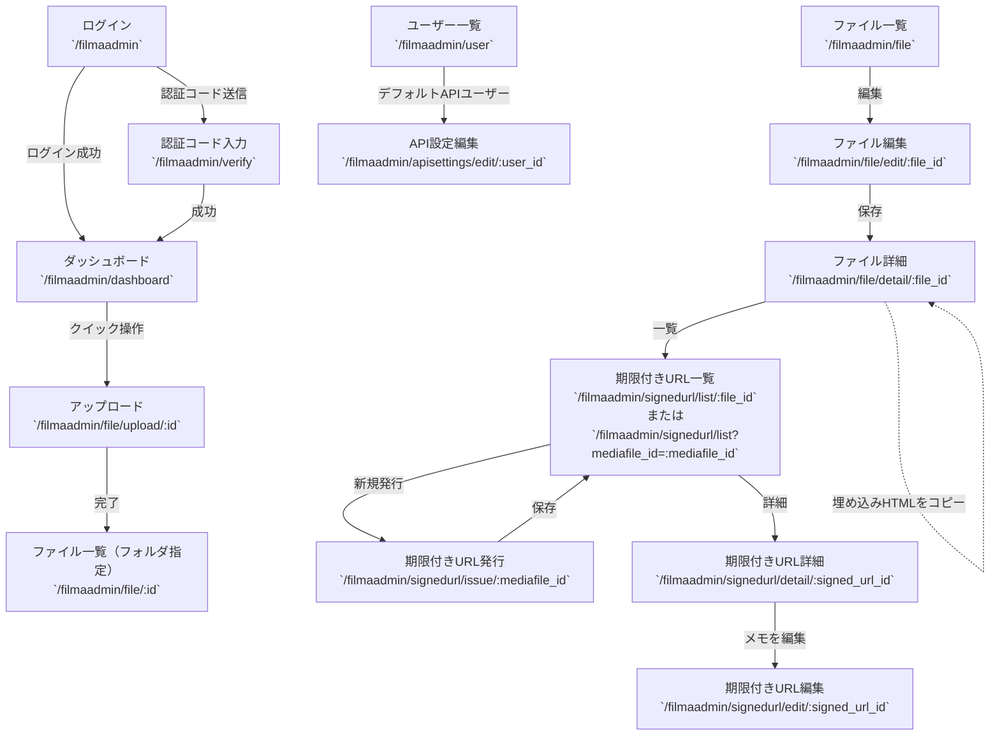

# 画面URLと遷移

## 主なURL一覧

- ログイン: `/filmaadmin`
- ダッシュボード: `/filmaadmin/dashboard`
- ファイル一覧: `/filmaadmin/file`
- フォルダ一覧: `/filmaadmin/folder`
- ユーザー一覧: `/filmaadmin/user`
- ファイル編集: `/filmaadmin/file/edit/:file_id`
- ファイル詳細: `/filmaadmin/file/detail/:file_id`
- アップロード: `/filmaadmin/file/upload/:folder_id`
- API設定編集: `/filmaadmin/apisettings/edit/:user_id`
- 期限付きURL: 発行 `/filmaadmin/signedurl/issue/:mediafile_id` / 一覧 `/filmaadmin/signedurl/list/:file_id` または `/filmaadmin/signedurl/list?mediafile_id=:mediafile_id` / 詳細 `/filmaadmin/signedurl/detail/:signed_url_id`

## 遷移図（フローチャート）

---

## 遷移図（テキスト）

### 認証:
- ログイン（`/filmaadmin`） 
→ ログイン成功 
→ ダッシュボード（`/filmaadmin/dashboard`）
- ログイン（`/filmaadmin`）  
→ 認証コード送信  
→ 認証コード入力（`/filmaadmin/verify`）  
→ 成功  
→ ダッシュボード（`/filmaadmin/dashboard`）

### アップロード/公開:
- ダッシュボード（`/filmaadmin/dashboard`）  
→ クイック操作  
→ アップロード（`/filmaadmin/file/upload/:id`）  
→ 完了  
→ ファイル一覧（`/filmaadmin/file/:id`）
- ファイル一覧（`/filmaadmin/file`）  
→ 「編集」 
→ ファイル編集（`/filmaadmin/file/edit/:file_id`）  
→ 保存  
→ ファイル詳細（`/filmaadmin/file/detail/:file_id`）

### 期限付きURL:
- ファイル詳細（`/filmaadmin/file/detail/:file_id`）  
→ 「期限付きURL一覧」 
→ 期限付きURL一覧（`/filmaadmin/signedurl/list/:file_id` または `/filmaadmin/signedurl/list?mediafile_id=:mediafile_id`）
- 期限付きURL一覧  
→ 「新規発行」 
→ 期限付きURL発行（`/filmaadmin/signedurl/issue/:mediafile_id`）  
→ 保存  
→ 一覧に反映
- 期限付きURL一覧  
→ 「詳細」 
→ 期限付きURL詳細（`/filmaadmin/signedurl/detail/:signed_url_id`）  
→ 「メモを編集」 
→ 期限付きURL編集（`/filmaadmin/signedurl/edit/:signed_url_id`）

### 埋め込みHTML 初回準備:
- ユーザー一覧（`/filmaadmin/user`）  
→ デフォルトAPIユーザー  
→ API設定編集（`/filmaadmin/apisettings/edit/:user_id`）でアクセス許可ドメイン設定
- ファイル詳細（`/filmaadmin/file/detail/:file_id`）  
→ 「埋め込みHTMLをコピー」 
→ 自サイトへ貼付け

### ユーザー管理:
- ユーザー一覧（`/filmaadmin/user`）  
→ 新規/編集/削除  
→ 詳細/一覧
