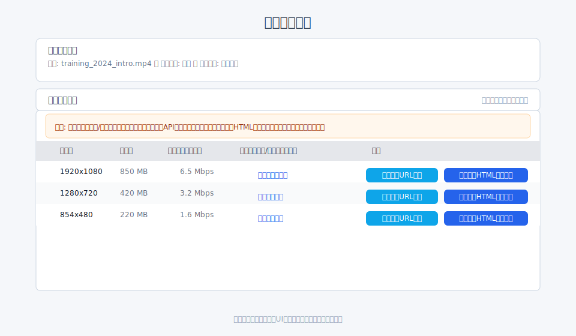
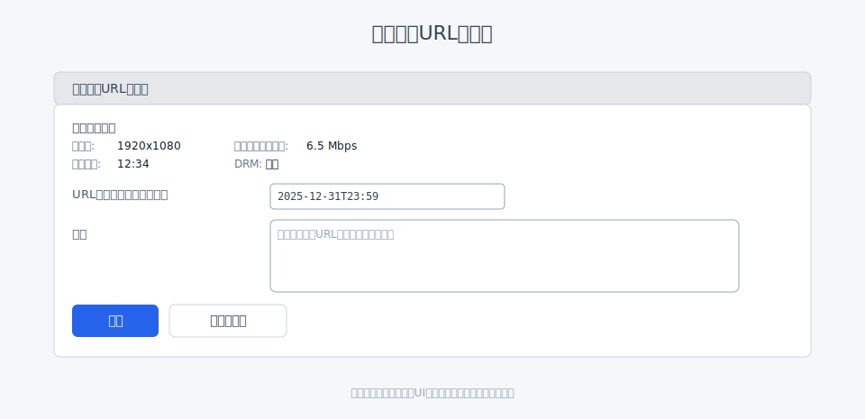
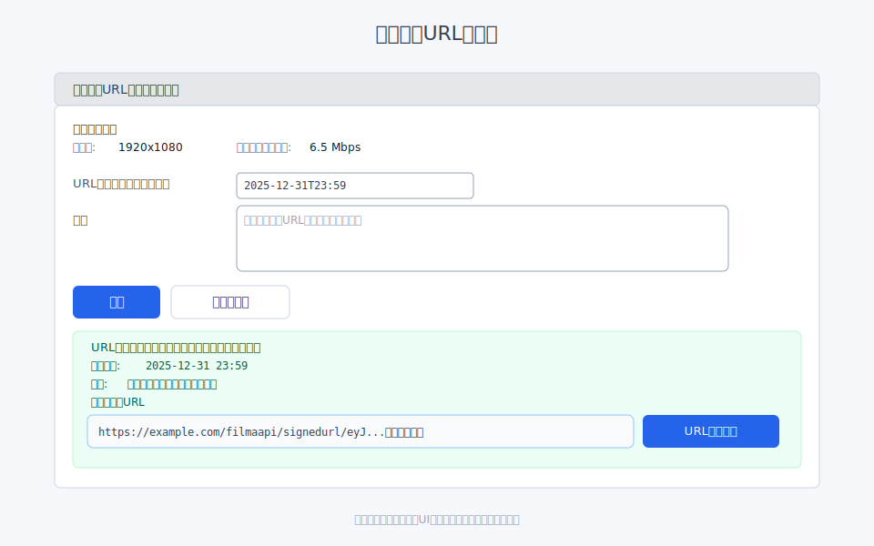
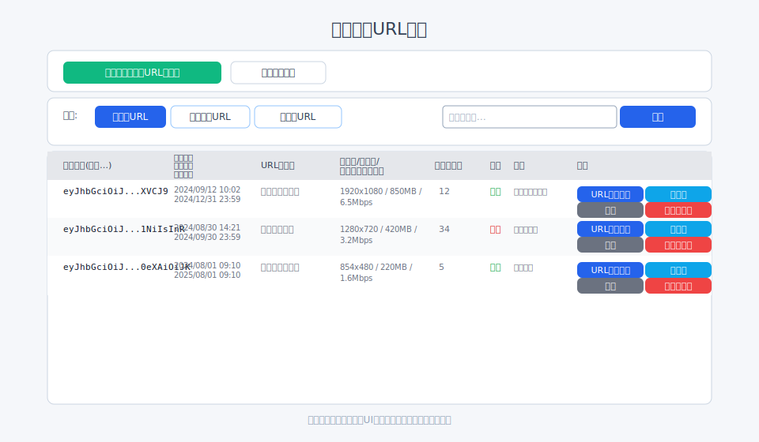

# 期限付きURLの発行

[← クイックスタートへ戻る](index.md#_3)

## 画面URL

- 発行: `/filmaadmin/signedurl/issue/:mediafile_id`
- 一覧: `/filmaadmin/signedurl/list/:file_id` または `/filmaadmin/signedurl/list?mediafile_id=:mediafile_id`
- 詳細: `/filmaadmin/signedurl/detail/:signed_url_id`

## 発行（派生メディア単位）

1. 「ファイル詳細」(`/filmaadmin/file/detail/:file_id`) → 「派生メディア」
   ※「派生メディア」は折りたたみ表示のため、見出しをクリックして開きます。
2. 対象解像度行の「期限付きURL生成」をクリック → 発行画面（`/filmaadmin/signedurl/issue/:mediafile_id`）へ遷移
   
3. 発行画面で「URL有効期限」「メモ」を入力し「保存」
   
4. 生成結果が同画面に表示され、URLをコピー可能（保存ボタンの下に成功メッセージと生成URL欄が表示されます）
   

## 一覧と運用

- 一覧で検索（メモ）/フィルタ（有効/全件/無効）に対応
- 各行から「URLをコピー」「無効にする」「再発行」「詳細」
   

## 注意

- 有効期限切れ/無効化されたURLはアクセス不可になります
- メモは詳細画面から編集可能
- 「メディアファイル情報」の **ダウンロード／ストリーミング** にも「期限付きURL生成」があります
  （ダウンロード用／ストリーミング用のURLを用途別に発行できます）

## 公開設定との関係（重要）

- 期限付きURLは「URL固有の有効期限」でアクセス可否を制御しますが、元ファイルの公開設定も同時に考慮されます。
  - 対象ファイルが「公開OFF」または「公開期限切れ（published_untilを過ぎている）」の場合、期限付きURLが有効でもアクセスはできません（404相当）。
  - 対象ファイルが公開中かつ期限内である必要があります。
- 期限付きURLの有効期限を延長・短縮しても、元ファイルの公開期限は自動では変わりません。用途に応じて両者を調整してください。
- 既存の期限付きURLがある状態でファイルを非公開にした場合、以後そのURLはアクセス不可になります（ファイルの公開再開で再びアクセス可能）。

## 検索・フィルタ・再発行の注意点

- 検索はメモ欄に対して行われます。キーワードは部分一致です。
- フィルタは「有効/全件/無効」から選択します。期限切れは「無効」に含まれます。
- 再発行は同一メディアで新規にURLを作成します。既存URLは自動では無効化されないため、不要になったURLは「無効にする」を実行してください。
- 「URLをコピー」ボタンは完全なURL（トークン付き）をクリップボードにコピーします。共有先の管理にご注意ください。

---

### 次にやること / 関連

- サイト埋め込み（HTML）: [埋め込みHTML](embed_html.md)
- サイト埋め込み（API）: [APIを使った埋め込み](embed_api.md)
