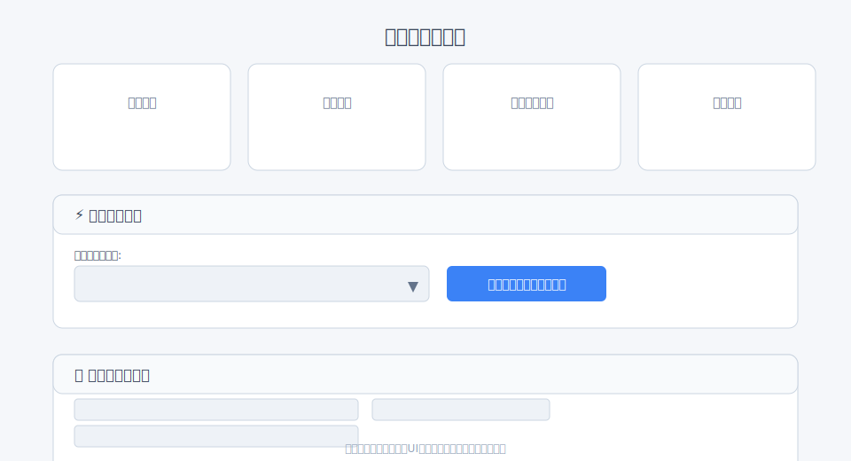
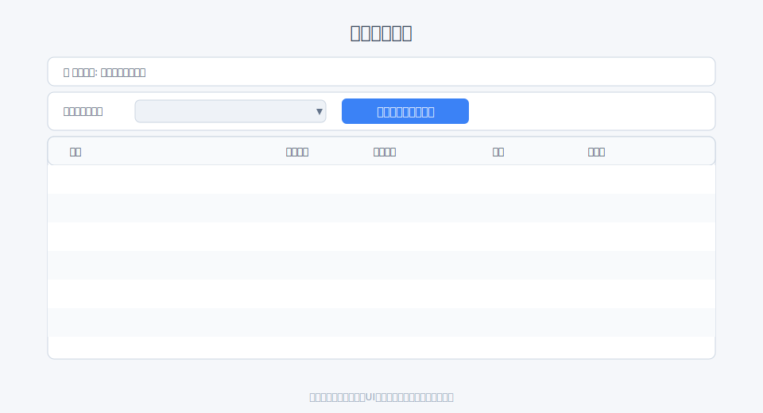
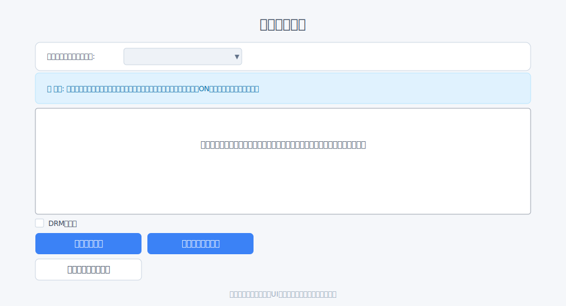

# 動画のアップロード

[← クイックスタートへ戻る](index.md#_3)

## 画面URL

- ファイル一覧: `/filmaadmin/file`
- アップロード: `/filmaadmin/file/upload/:id`

## 推奨ルート

- ダッシュボード `/filmaadmin/dashboard` → 「クイック操作」→ フォルダ選択 → アップロード画面へ
  
- もしくは、ファイル一覧 `/filmaadmin/file` → 「ファイルを追加する」
  

## 手順

1. アップロード先フォルダを選択
2. 「こちらをクリック」またはドラッグ&ドロップでファイル（複数可）を選択
3. DRM化したい場合は「DRM化する」にチェック（任意）
4. 「アップロード」を押下

## 注意

- 待機/実行中のファイルがある状態でフォルダを切り替えると確認ダイアログが表示されます
- アップロード直後は「未公開」です。公開は「[動画の公開](publish.md)」を参照
- DRM化したファイルは元に戻せません（詳細は [DRM化](drm.md) を参照）

## アップロード要件

推奨要件

- 推奨形式: MP4（H.264 + AAC）。拡張子は `.mp4` を推奨
- 音声トラック: 無音でも「音声トラックあり」にしてください（トラックが無いと処理に失敗します）
- 解像度の目安: 1080p（フルHD）/ 720p（HD）/ 480p いずれか
- 画質の目安: 1080pなら映像 6–8 Mbps 程度、720pなら 3–5 Mbps 程度（あくまで目安）
  - UHD（4K）もエンコード可能です。
    - メリット: 大画面や高精細端末での視聴品質が向上します。
    - 留意点: 原本の品質が十分に高いことが前提です（低品質な4Kは粗が目立ちます）。
    - 不利になりやすい点: ファイルサイズが大きくアップロード・処理時間が長くなる／視聴側の回線・端末負荷が上がる（再生が不安定になりやすい）／ストレージ・配信コストが増える可能性があります。
    - 運用の目安: まずはフルHDでの十分な品質確保を優先し、必要なコンテンツから段階的に4K対応をご検討ください。
- ファイル名: 半角英数字・ハイフン/アンダースコアを推奨（日本語や特殊記号は避ける）
- メタ情報: タイトル/タグ/カテゴリはアップロード後に編集画面で設定可能

よくあるNG

- 音声トラックが付いていない（無音=音声なし ではなく、無音=音声あり にしてください）
- 画質が低すぎる原本（特に高解像度での再生時に粗く見えます）
- ProRes/MKV/AVI など、そのままだと配信に向かないフォーマットのままアップロード

### 他のフォーマットも使いたいときは（MOV / WMV）

- MOV を使いたい場合
    - そのままでも処理できることはありますが、配信の互換性と安定性の点で MP4 に比べて不利になることがあります。
    - 可能なら MP4（H.264 + AAC）に変換してからアップロードしてください（再生の安定化と処理時間の短縮につながります）。

- WMV を使いたい場合
    - 旧来のWMVファイルはそのままでは想定どおり再生できないことがあります。
    - 可能なら MP4（H.264 + AAC）に変換してからアップロードしてください（不具合の回避につながります）。

### 次にやること / 関連

- 公開設定へ進む: [動画の公開](publish.md)
- トラブル時の確認: [埋め込みHTML](embed_html.md) の「よくある失敗と対処」も参照
- 画面遷移を確認: [画面URLと遷移](routes_flow.md)
